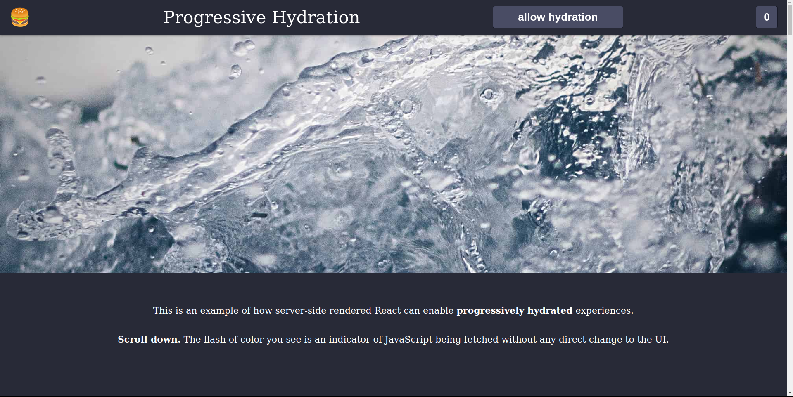
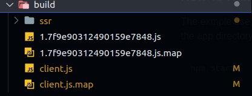
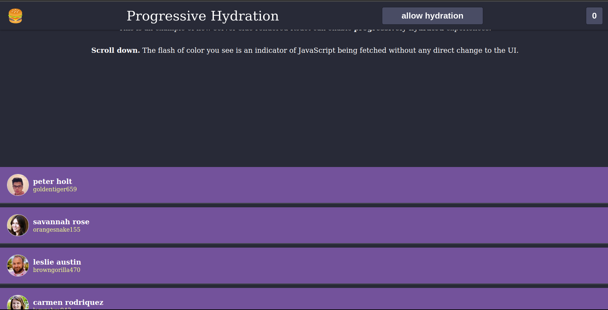
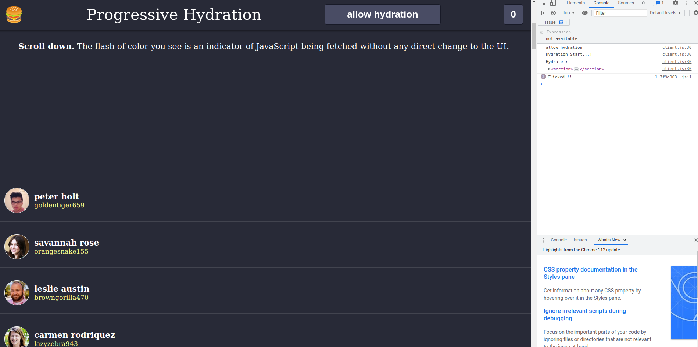

# Progressive Hydration
This repo for duscuss about the Progressive Hydration.The Progressive Hydration Is a technique used in react to improve performance and user experience. By load the static UI First and the delay the js untill the main content loaded. [LEARN MORE](https://github.com/AhmadEleiwa/ProgressiveHydration/blob/main/Progressive%20Hydration.pdf)


## Example : react progressive hydration 
In this example, we have header and hero-section(intro) and list of users. The point we need to 
hydrate the page progressively. The header and the intro hydrate it at the beginning. 
The list of users hydrate when we scroll down.

The the allow hydrate button is for let use to test before/after the allow the hydration operation.



### How To Run
The exmple use Webpack to generate the bunlders. You notice that we have Server.js witch is an express 
app. And the app directory is our react app (fronend). You can run the app with using this command in the terminal 
```bash
npm start 
```
<p>
After Run this command the server start building the bundles
</p>




### How it works
To enable the hydration to our list we have to click on the button 'allow hydration'
let's try witout clicking the button and scroll down into the list. So What you notice ? actually nothing change let's try to click on the user avator image and watch our console in the browser.
Still !! nothing happen.

Now lets refersh the site and try again with clicking on the button to enable the hydration to the list

**SCRLL DOWN**



**CLICKING ON AVATOR**

